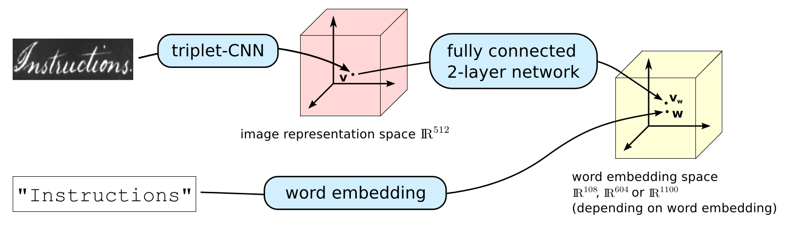

## Semantic and Verbatim Word Spotting using Deep Neural Networks


This is a minimal implementation of the model from the paper [Semantic and Verbatim Word Spotting using Deep Neural Networks](http://www.diva-portal.org/smash/get/diva2:1044046/FULLTEXT01.pdf). The model allows you to embed word images into any general vector space in which you can perform query-by-example and query-by-string word spotting (image retrieval) and probably perform decent enough transcription of word images. The model is a [pre-activation ResNet](https://arxiv.org/pdf/1603.05027.pdf) followed by a small MLP that embeds an image into a word embedding space.

This space can be verbatim (distance corresponds to string similarity) and semantic (distance corresponds to string and semantic similarity). Two of the embeddings investigated in the paper are learned word embeddings extracted from the LSTM-char-large model from the paper [Character-Aware Neural Language Model](https://arxiv.org/pdf/1508.06615.pdf). Get authors' Torch implementation from [here](https://github.com/yoonkim/lstm-char-cnn).

Parts of this code is based on the PN-Net architecture for learning local image descriptors, available at https://github.com/vbalnt/pnnet.

If you make use of this code in a scientific context, please cite 

```
@inproceedings{Wilkinson2016_WS,
   booktitle = {International Conference on Frontiers in Handwriting Recognition},
   author = {Wilkinson, Tomas and Brun, Anders.},
   title = {{Semantic and Verbatim Word Spotting using Deep Neural Networks}},
   year = {2016}
}
```

#### Paper Errata
When preparing my code for this release, I have discovered mistake in the paper. I accidentally write that I use the [original ResNet](https://arxiv.org/pdf/1512.03385v1.pdf) model but I actually used the [pre-activation ResNet](https://arxiv.org/pdf/1603.05027.pdf).

### Requirements
As of now, the code requires an NVIDIA GPU with CUDA installed. The triplet network requires less than 6 GBs of memory while the embedding network requires less than 2 GBs. You can further reduce the memory footprint by using the [OptNet](https://github.com/fmassa/optimize-net) package. This could be useful if you have trouble fitting your models on your GPUs.

The code is written in Python and Lua, and requires Torch, which can be installed from [here](http://torch.ch/docs/getting-started.html). 

It also requires the following Torch packages: 
 - npy4th
 - hdf5

which can be installed with 
```
luarocks install npy4th
luarocks install hdf5
```

It also has the following python dependencies:
 - numpy
 - scipy
 - h5py
 - scikit-image

which can be installed using the command 
```
pip install numpy scipy skimage h5py
```

### Data
You can download the Washington dataset from [this link](http://ciir.cs.umass.edu/downloads/gw/gw_20p_wannot.tgz) or using 

```
cd data/washington
wget http://ciir.cs.umass.edu/downloads/gw/gw_20p_wannot.tgz
tar -xzf gw_20p_wannot.tgz
cd ../../
```

You also need to download the embeddings and put them in the embeddings folder

```
mkdir embeddings
cd embeddings
wget http://user.it.uu.se/~tomwi522/washington_embeddings.zip
unzip washington_embeddings.zip
cd ../
```

Finally, you need to download the model used to initialize the networks, trained on the [CVL](https://www.caa.tuwien.ac.at/cvl/research/cvl-databases/an-off-line-database-for-writer-retrieval-writer-identification-and-word-spotting/) dataset.


```
mkdir pretrained
cd pretrained
wget http://user.it.uu.se/~tomwi522/presnet_34_cvl_iter_185000.t7
cd ../
```

### Pre-trained models 
You can download some [pre-trained models](https://drive.google.com/open?id=0B3A3gL1SjnBMaW80QlV0d2swQ1E) for a fold 1 using the 4 embeddings. Trained using this code base. Note that these models are saved as CudaTensors and thus require cutorch and cudnn.

### Training from scratch
Code to setup the Washington dataset is suplied in misc/preprocess.py. Running
```
python misc/preprocess.py
```
will load the Washington dataset, setup the necessary image and embedding hdf5 databases. 

Make sure to download the Washington dataset before running this

Then run 

```
./train_net.sh
```

To train the triplet network and the 4 different embeddings. You can comment away some of the commands if you're only interested in one specific embedding.

To evaluate the models first run

```
th misc/eval.lua
```

to extract descriptors for each word image, then run 

```
python eval_test.py
```

to get QbE and QbS MaP scores for the different. It should look something like this:

```
triplet Washington QbE  94.0120767804 , QbS: -100.0
semantic Washington QbE  96.7435996072 , QbS: 71.2676505913
ngram Washington QbE  96.9961577901 , QbS: 82.7666758942
phoc Washington QbE  97.7626788718 , QbS: 92.6989763255
dct3 Washington QbE  97.3370356691 , QbS: 94.1436752847
```

### Training on new data
To train on a new dataset you need to create corresponding function in misc/db_utils.py that loads the dataset in question. The function should return a list of data where each entry is a dictionary with the following keys/values:

 - file: The absolute path to the word image
 - split: one of 'train'/'val'/'test'
 - text: the ground truth transcription.

all values should be strings. Then you need to modify misc/preprocess.py to load your dataset instead and create your hdf5 databases. The rest of the process should just require minor changes to the existing scripts to train on a new dataset.

### Licence

Copyright (c) <2016> <Tomas Wilkinson>

Permission is hereby granted, free of charge, to any person obtaining a copy
of this software and associated documentation files (the "Software"), to deal
in the Software without restriction, including without limitation the rights
to use, copy, modify, merge, publish, distribute, sublicense, and/or sell
copies of the Software, and to permit persons to whom the Software is
furnished to do so, subject to the following conditions:

The above copyright notice and this permission notice shall be included in all
copies or substantial portions of the Software.

THE SOFTWARE IS PROVIDED "AS IS", WITHOUT WARRANTY OF ANY KIND, EXPRESS OR
IMPLIED, INCLUDING BUT NOT LIMITED TO THE WARRANTIES OF MERCHANTABILITY,
FITNESS FOR A PARTICULAR PURPOSE AND NONINFRINGEMENT. IN NO EVENT SHALL THE
AUTHORS OR COPYRIGHT HOLDERS BE LIABLE FOR ANY CLAIM, DAMAGES OR OTHER
LIABILITY, WHETHER IN AN ACTION OF CONTRACT, TORT OR OTHERWISE, ARISING FROM,
OUT OF OR IN CONNECTION WITH THE SOFTWARE OR THE USE OR OTHER DEALINGS IN THE
SOFTWARE.


